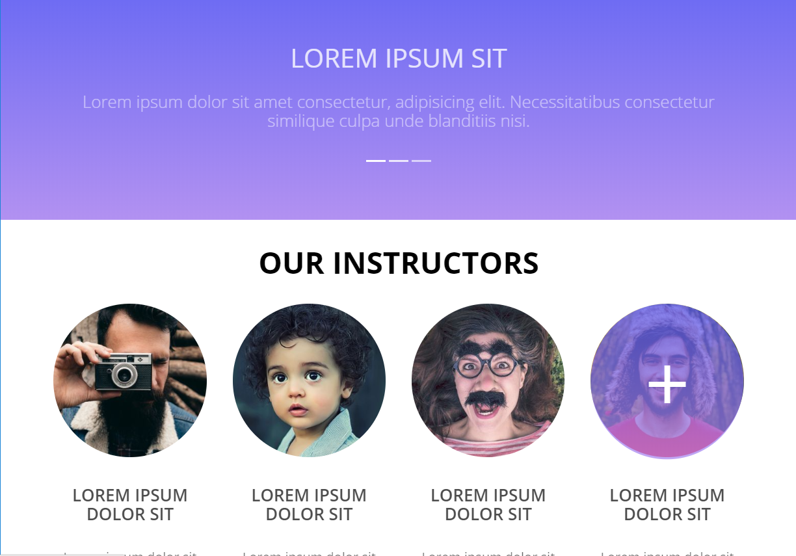
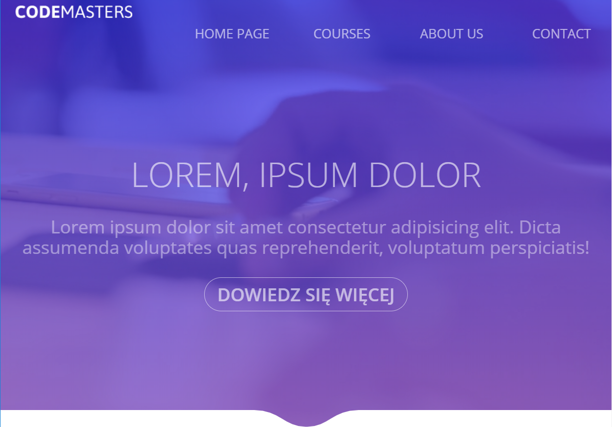

# SassProject

> A simple website designed using the Sass preprocessor

## Table of contents

- [General info](#general-info)
- [Screenshots](#screenshots)
- [Technologies](#technologies)
- [Link](#setup)
- [Status](#status)

## General info

A simple website designed using the Sass preprocessor. The project was created as part of a course at CodersLab.

## Screenshots

## Technologies

- HTML5
- Sass and CSS3
- Webpack
- Gulp

## Link

https://joanna-chadzynska.github.io/SassProject/

## Status

Project is: _finished_
